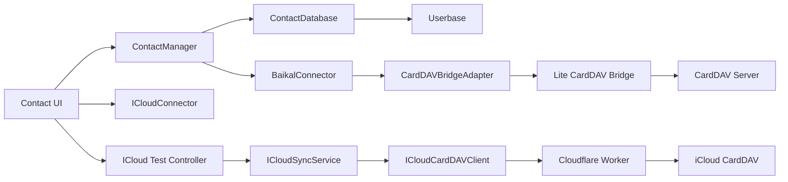
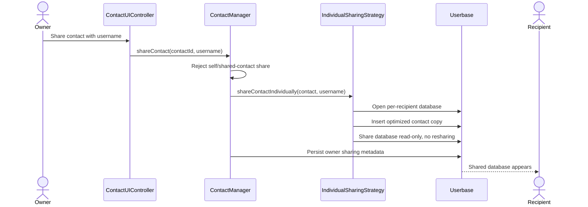

# Contact Management System: Feature, Cleanup, and Review Baseline

**Review date:** 2026-09-11  
**Basis:** Static review of production code, configuration, and configured tests  
**Primary scope:** User-to-user sharing, iCloud synchronization, generic CardDAV synchronization, and the supporting contact-management features

## 1. Purpose

This document provides a code-grounded overview of the application before a deeper code review and cleanup. It is intended to answer four questions:

1. Which features are implemented in production code?
2. How do user sharing and CardDAV synchronization currently work?
3. Which behavior is incomplete, duplicated, or contradictory?
4. In what order should the codebase be cleaned up and reviewed?

Documentation claims are not treated as implemented unless a matching production code path was found.

## 2. Status Definitions

| Status | Meaning |
|---|---|
| Implemented | Production code and UI wiring exist. |
| Partial | Core code exists, but integration, correctness, or coverage is incomplete. |
| Broken wiring | Components exist, but their active caller and callee contracts do not match. |
| Experimental | Reachable mainly through test or diagnostic UI. |
| Legacy/stale | Superseded code remains and may conflict with current architecture. |
| Documented only | No controlling production implementation was confirmed. |

## 3. Executive Summary

The application has a substantial contact-management core and a real Userbase-based sharing implementation. Contact CRUD, vCard 3.0 processing, file import/export, QR codes, search, filters, archives, user groups, mobile navigation, and themes are present in production code.

The strongest implemented collaboration feature is the **individual sharing strategy**: every contact-recipient relationship receives a separate Userbase database. Owner updates are propagated to those databases and recipients receive real-time change events.

The largest cleanup need is external synchronization. The repository currently contains:

- a generic CardDAV path built around `BaikalConnector` and `CardDAVBridgeAdapter`;
- an alternate `ICloudConnector` used by the main CardDAV settings UI;
- a separate, better-tested `ICloudSyncService` used by the iCloud diagnostic modal;
- a Cloudflare Worker whose forwarding behavior does not match all client assumptions.

These paths overlap without sharing a stable connector contract. As a result, the codebase should not yet be described as having one reliable production iCloud/CardDAV synchronization architecture.

## 4. System Overview



### Main ownership boundaries

| Component | Current responsibility |
|---|---|
| [`ContactManager`](src/core/ContactManager.js) | Contact CRUD, search, lifecycle, sharing orchestration, import logic, sync-aware behavior, group management, and metadata. |
| [`ContactDatabase`](src/core/ContactDatabase.js) | Userbase authentication, databases, persistence, real-time handlers, shared-database discovery, and SDK wrappers. |
| [`IndividualSharingStrategy`](src/core/IndividualSharingStrategy.js) | Per-recipient database creation, share updates, and revocation item deletion. |
| [`ContactUIController`](src/ui/ContactUIController.js) | Main UI coordination, forms, import/export, sharing, groups, archive workflows, profile links, and rendering coordination. |
| [`BaikalConnector`](src/integrations/BaikalConnector.js) | Generic CardDAV pull, import, push, deletion, authority behavior, and timers. |
| [`ICloudSyncService`](src/integrations/ICloudSyncService.js) | Dedicated iCloud two-way synchronization and shared-contact refresh. |

Several of these classes own too many concerns and should be split only after behavioral contracts are covered by tests.

## 5. Feature Inventory

### 5.1 Authentication and persistence

| Feature | Status | Evidence and notes |
|---|---|---|
| User sign-up | Implemented | Userbase-backed sign-up in [`ContactDatabase`](src/core/ContactDatabase.js). |
| User sign-in/sign-out | Implemented | Includes generic error handling and application-state cleanup. |
| Session restoration | Implemented | Persistent and session-only preferences are handled by the database and UI controllers. |
| Remember me | Implemented | Userbase session mode plus local preference keys. |
| Login throttling | Implemented | Failed-attempt backoff is managed by [`ContactUIController`](src/ui/ContactUIController.js). |
| End-to-end contact storage | Implemented through dependency | Userbase performs encrypted storage and synchronization. The application consumes the SDK. |
| Cross-device contact updates | Implemented through dependency | Userbase change handlers feed `contacts:changed` events into `ContactManager`. |

### 5.2 Contact data and lifecycle

| Feature | Status | Notes |
|---|---|---|
| Create and edit contacts | Implemented | Form validation and vCard generation are part of the main workflow. |
| Phone numbers | Implemented | Multiple values, type, and primary selection. |
| Email addresses | Implemented | Multiple values, type, and primary selection. |
| URLs | Implemented | Multiple values, type, and primary selection. |
| Postal addresses | Implemented | Street, city, state, postal code, country, type, and primary selection. |
| Organization/title | Implemented | Stored in vCard. |
| Birthday | Implemented | Date validation and display formatting. |
| Notes | Implemented | Multiple notes with configured length validation. |
| Owned-contact delete | Implemented | Soft delete first; external sync may later perform remote and hard deletion. |
| Shared-contact remove | Partial | Local removal exists, but recipient-specific deletion semantics and future Userbase updates need explicit product rules. |
| Archive/restore owned contact | Implemented | State is stored with the owned contact. |
| Archive/restore shared contact | Implemented | Recipient-specific state is stored in `shared-contact-metadata`. |
| Favorites/pinning metadata | Partial | Metadata fields exist, but the complete user workflow was not confirmed during this review. |
| Usage tracking | Implemented | Access count and a bounded interaction history are persisted. |
| Bulk delete | Implemented | Sync services are paused and resumed around bulk operations. |

### 5.3 Discovery, organization, and presentation

| Feature | Status | Notes |
|---|---|---|
| Text search | Implemented | Searches card name, vCard content, and list names with caching. |
| Sorting | Implemented | Name, creation, update, access, and recent activity. |
| Filters | Implemented | Owned, shared, imported, archived, recent, favorites, and groups. |
| Statistics | Implemented | Active, archived, owned, shared, imported, recent, and favorites. |
| User groups/distribution lists | Implemented | Lists contain usernames and are stored in user settings. |
| Contact categorization lists | Implemented | Contacts can also carry `metadata.distributionLists`. This is distinct from sharing groups and the naming should be clarified. |
| Dark mode | Implemented | Persistent light/dark preference. |
| Mobile navigation | Implemented | Menu, contacts, and detail page navigation. |
| Profile URL sharing | Implemented | Profile routing and email/link sharing UI exist. |

### 5.4 Portability

| Feature | Status | Notes |
|---|---|---|
| vCard 3.0 generation | Implemented | This is the active format in [`VCardStandard`](src/core/VCardStandard.js). |
| vCard 3.0 import | Implemented | Includes multiple-card files and duplicate detection. |
| vCard 4.0 processor | Preserved/secondary | The processor and format manager exist, but the main application delegates to vCard 3.0. |
| Duplicate detection | Implemented | Uses name, phone, email, organization, title, qualifiers, and richness scoring. |
| File export | Implemented | All, owned, or active contacts exported as vCard 3.0. |
| QR code | Implemented | Generated client-side as PNG from vCard content. |
| Sharing recovery through `CATEGORIES` | Partial/risky | Owner recipient lists are embedded in internal vCards for restoration. This creates privacy and external-format concerns. |

## 6. User-To-User Sharing

### 6.1 Current data model

Each relationship uses a separate Userbase database:

```text
shared-contact-{contactId-without-contact-prefix}-to-{username}
```

Example:

```text
shared-contact-abc123-to-alice
shared-contact-abc123-to-bob
```

The owner keeps the canonical contact in `contacts`. Each recipient database contains a copy with additional sharing metadata.

### 6.2 Share flow



### 6.3 Implemented sharing behavior

| Behavior | Status | Notes |
|---|---|---|
| Share with one username | Implemented | Per-recipient database. |
| Share with multiple usernames | Implemented | UI loop and a batched strategy both exist. |
| Share with a user group | Implemented | Group expands to individual shares at share time. |
| Share own profile with a group | Implemented | Uses repeated individual shares. |
| Prevent self-sharing | Implemented in UI/manager paths | Should also be enforced at the lowest shared API boundary. |
| Prevent recipient resharing | Implemented | Received IDs are rejected and Userbase share uses `resharingAllowed: false`. |
| Recipient read-only access | Implemented | The effective strategy always writes `readOnly: true`. |
| Optional write access | Not actually implemented | Parameters and metadata suggest support, but the strategy hardcodes read-only. |
| Optional verification | Implemented but not required | User verification methods exist; shares use `requireVerified: false`. |
| Real-time owner updates | Implemented | Owner updates fan out to individual shared databases. |
| Cross-device discovery | Implemented | Shared databases are opened at startup and monitored every 10 seconds, with an hourly fallback refresh. |
| Per-recipient archive state | Implemented | Stored separately from the owner’s contact. |
| Per-recipient usage state | Implemented | Stored in recipient metadata. |
| Granular revocation | Partial | The item is deleted for one recipient, but permission revocation is missing. |

### 6.4 Sharing findings

#### SH-01: Revocation does not revoke database permission

**Priority:** P0  
**Location:** [`IndividualSharingStrategy.revokeIndividualAccess()`](src/core/IndividualSharingStrategy.js)

The method deletes the contact item but does not call the existing `safeModifyDatabasePermissions()` wrapper with `revoke: true`. The recipient loses the current item, but the empty database and its access relationship remain.

**Required cleanup:** Make revocation an idempotent operation that removes the item, revokes recipient permission, updates owner metadata, and records partial failures for retry.

#### SH-02: Shared copies can expose the owner’s recipient metadata

**Priority:** P0  
**Location:** [`IndividualSharingStrategy.shareContactIndividually()`](src/core/IndividualSharingStrategy.js)

The strategy copies the owner contact and compresses, rather than removes, `sharing.sharedWithUsers` and `sharePermissions`. A recipient may therefore receive information about other recipients.

**Required cleanup:** Introduce an explicit `buildRecipientContact()` projection containing contact data and only attribution relevant to the current recipient.

#### SH-03: Permission options are misleading

**Priority:** P1

`readOnly` and `resharingAllowed` are accepted throughout the manager and UI, but the strategy validates and submits `readOnly: true` and `resharingAllowed: false` unconditionally.

**Decision required:** Either remove write-access controls and document sharing as always read-only, or implement and test the alternate permission contract.

#### SH-04: Group provenance is contradictory

**Priority:** P1

Current group sharing intentionally stores only individual usernames. Legacy `distribution-sharing` databases and restoration methods remain. Adding or removing a group member attempts to infer which contacts were previously shared through that group.

That inference can affect contacts shared individually or through another group.

**Decision required:**

- Treat groups as one-time expansion only and remove retroactive group membership behavior; or
- persist immutable share provenance per contact, group, and recipient.

#### SH-05: Shared-contact deletion semantics need a product contract

**Priority:** P2

Recipients can archive a received contact locally. The business layer also contains a hard-delete path for shared contacts, while the current detail UI primarily exposes archive. Define whether recipient deletion means hide, unsubscribe, or permanently reject future updates.

#### SH-06: User validation creates persistent test databases

**Priority:** P2  
**Location:** `ContactManager.addUsernameToDistributionList()`

Username validation opens and shares a temporary database, while comments state that it cannot be deleted. This accumulates databases over time.

**Required cleanup:** Use a non-persistent verification API or reuse one bounded validation database.

## 7. Generic CardDAV Synchronization

### 7.1 Intended flow

1. Save a non-secret profile in Userbase settings.
2. Retrieve credentials through secure local storage.
3. Connect and discover address books.
4. Pull contacts from the selected address book.
5. Match by vCard UID.
6. Import new contacts or update existing contacts while preserving ownership flags.
7. Detect server-side deletions.
8. Clean up contacts deleted locally.
9. Immediately push local contact edits.
10. Periodically pull server changes and refresh shared contacts.

### 7.2 Current authority rules

| Contact type | Pull behavior | Push behavior | Deletion behavior |
|---|---|---|---|
| Owned | Server changes can update local contact after a short local-edit protection window. | Immediate push after local edit. | A previously synced contact missing remotely may be deleted locally. |
| Imported | Server is treated as conflict authority. | Local changes also push. | Server deletion removes local contact. |
| Shared | Server changes are intended to be ignored. | Recipient’s Userbase version is periodically force-pushed. | Revocation should delete the external copy. |

The owned-contact behavior conflicts with several comments that claim the owner always has authority. The code currently implements bidirectional behavior for previously synced owned contacts.

### 7.3 Generic CardDAV findings

#### CD-01: Addressbook routing is not honored

**Priority:** P0  
**Locations:** [`BaikalConnector.getAddressbookForContact()`](src/integrations/BaikalConnector.js), [`CardDAVBridgeAdapter.pushContact()`](src/integrations/CardDAVBridgeAdapter.js)

The connector calculates `my-contacts`, `shared-contacts`, or `default`, but the adapter ignores that argument and always uses one stored `addressbookUrl`.

**Impact:** The claimed split between writable owned contacts and read-only shared contacts is not implemented by this path.

#### CD-02: Checked-in proxy supports iCloud only

**Priority:** P0  
**Location:** [`cloudflare-worker-carddav-proxy.js`](cloudflare-worker-carddav-proxy.js)

The Worker allowlists only iCloud hosts. The generic connector is configured with the same proxy URL, so remote Baikal, Nextcloud, Radicale, and generic hosts are rejected. Local servers may bypass the proxy.

The generic bridge also expects `proxyToken`, while application composition passes no token under that property.

**Required cleanup:** Separate the iCloud proxy from generic CardDAV transport, or deploy a carefully allowlisted generic proxy with explicit per-profile policy.

#### CD-03: ETag is stored but not used on push

**Priority:** P1

`BaikalConnector.pushContactToBaikal()` always passes `null` to the adapter. This forces a write without optimistic concurrency even when an ETag is available.

**Required cleanup:** Pass the normalized stored ETag for updates, use create-only semantics for new contacts, and define a 412 conflict resolver.

#### CD-04: `cardDAV` and `carddav` metadata keys coexist

**Priority:** P1

Generic sync code reads and writes both spellings. The centralized metadata updater writes lowercase `carddav`, while multiple call sites inspect uppercase `cardDAV`.

**Impact:** Unchanged checks, deletion detection, href lookup, and conflict windows can silently miss metadata.

**Required cleanup:** Migrate to one schema, preferably `metadata.carddav`, with a one-time compatibility reader.

#### CD-05: Server-deletion policy is broader than its comments

**Priority:** P1

Comments state that only imported contacts are deleted when absent remotely. The implementation deletes any non-shared contact that has CardDAV metadata, including owned contacts.

**Decision required:** Define whether remote deletion wins for owned contacts, then encode that decision in one authority policy object and tests.

#### CD-06: Orphan cleanup can remove legitimate remote-only contacts

**Priority:** P1

After importing server contacts, cleanup compares all server UIDs with local UIDs and deletes unmatched server contacts. This is high-risk when an import fails, IDs drift, or another CardDAV client creates data during the sync.

**Required cleanup:** Delete remotely only from durable local deletion tombstones. Absence from the current local map is insufficient evidence.

#### CD-07: ACL capability is inferred rather than verified

**Priority:** P2

Capabilities are inferred from URL text. No code in this repository was confirmed to create address books or configure server ACLs.

**Required cleanup:** Discover actual DAV capabilities and treat ACL setup as a separate server administration concern unless the server API proves otherwise.

## 8. iCloud Synchronization

### 8.1 Two competing implementations

| Path | Entry point | Intended mode | Current status |
|---|---|---|---|
| `ICloudConnector` | Main CardDAV profile UI | Comments/UI describe one-way export | Broken wiring |
| `ICloudSyncService` + `ICloudCardDAVClient` | iCloud test modal and `ContactManager` auto-push hooks | Two-way owned/imported sync plus shared force-push | Implemented in isolation and covered by mocked tests |

### 8.2 Implemented `ICloudSyncService` behavior

- CardDAV principal and addressbook discovery through a Cloudflare Worker.
- Full addressbook REPORT pull.
- UID-based local matching.
- ETag-based changed-contact detection.
- Import of new iCloud contacts as imported contacts.
- Update of owned/imported local contacts from iCloud.
- Immediate push after local create/edit once the service is connected.
- Remote and local deletion handling.
- 412 retry after fetching a fresh ETag.
- 403/404 recovery attempts using name and phone matching.
- Periodic force-push of shared Userbase contacts.
- Sync statistics and events.

### 8.3 iCloud findings

#### IC-01: Main profile UI and connector contracts do not match

**Priority:** P0  
**Locations:** [`BaikalUIController`](src/ui/BaikalUIController.js), [`ICloudConnector`](src/integrations/ICloudConnector.js)

The UI passes `{serverUrl, username, password, profileName}` to a connector that expects `{appleId, appSpecificPassword}`. The UI later calls `getConnectionStatus()` and `pushAllContacts()`, which `ICloudConnector` does not implement.

**Required cleanup:** Remove this connector path or make it implement the same tested interface as the chosen production service.

#### IC-02: The tested two-way service is presented as a test feature

**Priority:** P1

The better-covered implementation is initialized through `ICloudTestController` and a visible “iCloud Test” modal. It is not integrated with saved CardDAV profiles or secure auto-connect as one production workflow.

#### IC-03: Worker drops conditional request headers

**Priority:** P0

The Worker allows `If-Match`, `If-None-Match`, and `Prefer` in CORS preflight but does not copy them into the upstream request.

**Impact:** Client-side 412 handling and create/update preconditions do not provide real concurrency protection through the deployed proxy.

#### IC-04: Shared-contact cache is not used to choose update versus create

**Priority:** P1

`forcePushSharedContact()` checks `contact.metadata.carddav.etag`, but shared contacts generally cannot persist this metadata. A separate in-memory `sharedContactSyncCache` is written but not consulted for that decision.

**Impact:** Repeated refresh cycles may repeatedly attempt contact creation.

#### IC-05: Shared contacts are mutated during pull

**Priority:** P1

When an ETag differs, `pullFromICloud()` assigns the iCloud vCard to the existing object before branching on `isOwned`. Because that object is held by the contact map, a shared contact can be modified in memory despite comments stating that server changes are ignored.

#### IC-06: Force-push adds synthetic contact data

**Priority:** P1

Shared contacts without email receive `shared-contact@userbase.app` before upload. This changes the externally visible contact and can be mistaken for real data.

**Required cleanup:** Do not invent contact values. Handle server requirements explicitly and report unsupported records.

#### IC-07: Fuzzy UID recovery can merge distinct people

**Priority:** P1

403/404 recovery searches by normalized name or partial phone match and rewrites the local UID. This may bind separate contacts and violates the UID-as-primary-identity rule.

#### IC-08: Alternate bridge dynamically imports an unavailable bare dependency

**Priority:** P1

The lite bridge automatically enables `tsdav` for iCloud and performs `import('tsdav')`. The static root application has no browser import map or root dependency for that bare module.

## 9. Credential and Security Boundary

### Implemented controls

- Userbase encryption for application databases.
- HTTPS requirement for non-local generic CardDAV URLs.
- PBKDF2-SHA256 with 310,000 iterations.
- AES-256-GCM credential encryption.
- Legacy plaintext CardDAV password cleanup at startup.
- Worker origin allowlist, host allowlist, token check, and authorization-header newline removal.
- Existing security review in [`SECURITY_REVIEW.md`](SECURITY_REVIEW.md).

### Findings

#### SEC-01: “Session storage” is advertised but not implemented

`CredentialStorageUI` offers session storage, while `SecureCredentialStorage.storeCredentials()` has no session-storage write branch. Selecting it normally ends with “No encrypted storage available.”

#### SEC-02: Private-mode master password still depends on local storage

`setMasterPassword()` reads and writes its salt through `localStorage`, which is the capability that private-mode detection says may be unavailable.

#### SEC-03: Encrypted credential migration has a plaintext parser fallback

`getCredentials()` parses a stored value as plain JSON when no encryption key exists. This conflicts with the stated removal of plaintext credential storage.

#### SEC-04: Worker token is distributed in client configuration

The token is useful for reducing casual abuse but is not a secret when shipped to all clients. Security must continue to depend on origin and target restrictions, rate limiting, monitoring, and user credentials.

## 10. Data and Contract Cleanup

The cleanup should establish these invariants before broader refactoring:

### Contact identity

```text
vCard UID       Stable cross-system identity
contactId       Stable local domain identity; explicitly related to UID
itemId          Userbase item key; never inferred after persistence
remote href     Server resource location
ETag            Version of one specific remote resource
```

Creation currently generates the vCard before generating `contactId`, so the documented “contactId equals UID” rule is not guaranteed.

### Contact type

Use one derived type instead of scattered boolean and prefix tests:

```javascript
type: 'owned' | 'imported' | 'shared'
```

If backward compatibility requires booleans, derive them at the persistence boundary.

### CardDAV metadata

Use one key and one profile-aware structure:

```javascript
metadata.carddav = {
    profiles: {
        [profileId]: {
            href,
            etag,
            addressbookUrl,
            remoteUid,
            lastPulledAt,
            lastPushedAt,
            state
        }
    }
}
```

The current single `etag/href/profileName` shape cannot correctly support multiple profiles.

### Sharing metadata

Separate owner-only metadata from recipient projection:

```text
Owner contact
  sharing recipients, permissions, history

Recipient contact copy
  originalContactId, sharedBy, permission for current recipient

Recipient private metadata
  archive, usage, local preferences
```

### Authority policy

Define one executable policy table used by all sync services:

| Type | Remote update | Remote delete | Local update | Local delete |
|---|---|---|---|---|
| Owned | Product decision required | Product decision required | Push | Push tombstone |
| Imported | Accept | Accept | Decide whether push is supported | Push or local-only by policy |
| Shared | Reject | Never infer ownership revocation from CardDAV | Push owner copy only | Delete external recipient copy on Userbase revocation |

## 11. Test Baseline

### Configured Jest command

[`jest.config.js`](jest.config.js) includes only:

- `tests/icloud/**/*.test.js`
- `tests/dedup.test.js`

### Covered behavior

- iCloud pull import/update/skip behavior using mocks.
- iCloud push create/update/skip behavior using mocks.
- iCloud deletion in both directions using mocks.
- Shared-contact refresh using mocks.
- 412 retry using mocks.
- Email and phone vCard preservation.
- Duplicate qualifier and richness behavior.

### Not covered by the configured suite

- Real Userbase sharing.
- Permission revocation.
- Recipient projection/privacy.
- Group membership changes.
- Generic CardDAV discovery, pull, push, and delete.
- Multiple addressbooks and ACL behavior.
- Cloudflare Worker header forwarding.
- Credential storage choices and private mode.
- Main iCloud profile UI.
- Live iCloud or CardDAV end-to-end behavior.
- Mobile workflows and browser compatibility.

The legacy [`tests/integration.test.js`](tests/integration.test.js) is excluded by Jest configuration and still asserts vCard 4.0 behavior, so it is not a reliable current baseline.

## 12. Cleanup Backlog

### Phase 0: Protect data and sharing boundaries

- [ ] Revoke Userbase permissions as part of individual-share revocation.
- [ ] Strip owner recipient lists, permission maps, usage, and CardDAV metadata from recipient copies.
- [ ] Stop remote orphan deletion based solely on absence from the local map.
- [ ] Forward conditional headers through the Worker.
- [ ] Disable or remove the broken main iCloud profile path until one connector contract works.
- [ ] Add regression tests for all five changes.

### Phase 1: Consolidate external sync

- [ ] Choose one production iCloud implementation.
- [ ] Define a common connector interface: connect, disconnect, discover, pull, push, delete, status.
- [ ] Separate transport, synchronization policy, and UI concerns.
- [ ] Split iCloud proxy policy from generic CardDAV proxy policy.
- [ ] Implement actual addressbook selection rather than symbolic routing names.
- [ ] Normalize ETags before sending `If-Match`.
- [ ] Replace fuzzy UID reassignment with explicit conflict review.

### Phase 2: Normalize data contracts

- [ ] Migrate `cardDAV` to `carddav`.
- [ ] Make remote metadata profile-specific.
- [ ] Define and enforce UID/contactId/itemId relationships.
- [ ] Replace prefix-based shared detection with a contact type helper.
- [ ] Align validation with active vCard 3.0 generation.
- [ ] Decide whether internal sharing metadata belongs in vCard exports.

### Phase 3: Simplify sharing and groups

- [ ] Decide whether groups are one-time expansion or persistent policies.
- [ ] Remove stale distribution-sharing persistence if groups are one-time expansion.
- [ ] Otherwise, create explicit share provenance records and migration logic.
- [ ] Remove unused write-permission UI or implement it end to end.
- [ ] Replace persistent user-validation databases.
- [ ] Define delete versus archive versus unsubscribe for received contacts.

### Phase 4: Credential and security cleanup

- [ ] Implement the advertised session-storage option or remove it.
- [ ] Support private-mode salt storage without `localStorage`.
- [ ] Remove plaintext JSON credential fallback after migration.
- [ ] Escape dynamic profile/server values in credential dialogs.
- [ ] Add Worker rate limiting and deployment verification.
- [ ] Re-run the existing security review after sync consolidation.

### Phase 5: Structural cleanup

- [ ] Extract contact lifecycle, import/deduplication, sharing, groups, and sync coordination from `ContactManager`.
- [ ] Extract authentication, contact repository, settings repository, and shared-database discovery from `ContactDatabase`.
- [ ] Split `ContactUIController` by workflow.
- [ ] Remove alternate and backup connector implementations after migration.
- [ ] Remove disabled code blocks, stale comments, debug banners, and contradictory version claims.
- [ ] Update deployment scripts so only active runtime files ship.

### Phase 6: Expand verification

- [ ] Unit-test sharing projections and metadata migration.
- [ ] Contract-test Userbase SDK calls, including permission revocation.
- [ ] Contract-test Worker request forwarding.
- [ ] Add deterministic CardDAV fixtures for discovery, REPORT, PUT, DELETE, 404, and 412.
- [ ] Add end-to-end tests for owner update, recipient receipt, revocation, and CardDAV cleanup.
- [ ] Add live opt-in smoke tests for iCloud and one self-hosted CardDAV server.
- [ ] Add browser tests for mobile navigation, import/export, credentials, and themes.

## 13. Recommended Review Order

1. **Sharing security review:** recipient projection and revocation.
2. **Deletion review:** all local, remote, shared, and imported deletion paths.
3. **iCloud consolidation:** select the production stack and repair Worker forwarding.
4. **Generic CardDAV review:** transport, addressbooks, ETags, and authority policy.
5. **Identity review:** UID, contactId, itemId, href, and multi-profile metadata.
6. **Credential review:** persistence choices, private mode, and auto-connect.
7. **Import/export review:** vCard 3.0 consistency and sharing metadata leakage.
8. **UI review:** remove controls that do not map to supported behavior.
9. **Structural refactor:** only after the preceding contracts are tested.

## 14. Definition of Done

Cleanup should be considered complete when:

- One production iCloud path exists and the test modal is no longer a separate architecture.
- Generic CardDAV and iCloud use explicit, tested connector contracts.
- Revocation removes data and permissions for exactly one recipient.
- Recipient copies contain no owner-only sharing metadata.
- UID and CardDAV metadata invariants are documented and enforced.
- Remote deletion requires durable evidence and cannot result from a transient empty response.
- ETags reach the remote server and 412 behavior is tested through the Worker boundary.
- Group semantics are consistent across UI, persistence, and revocation.
- Credential UI choices match actual storage behavior.
- Automated tests cover sharing, revocation, generic CardDAV, Worker forwarding, and primary UI workflows.
- Documentation consistently describes vCard 3.0 as the active application format.

## 15. Review Notes

- This is a static code review baseline, not proof of live service behavior.
- Existing standalone HTML diagnostics and shell scripts are useful for investigation but are not substitutes for automated tests.
- No production behavior was changed while creating this document.